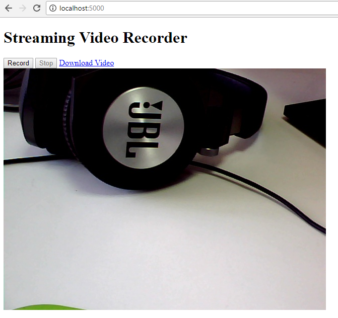

# Streaming Video Recorder
Use OpenCV-Python and Flask to create a web streaming video recorder for camera.

## Environment
* Python 2.7 or 3.5
* OpenCV 3.3.0

## How to Run 
1. Install **Flask**:

    ```
    pip install flask
    ```

2. Run the app:

    ```
    python server.py
    ```
    

## Reference
* https://github.com/log0/video_streaming_with_flask_example

## Blog
[How to Build Web Camera Recorder Using OpenCV and Flask][1]

[0]:https://en.wikipedia.org/wiki/Microsoft_Windows_SDK
[1]:http://www.codepool.biz/web-camera-recorder-oepncv-flask.html
