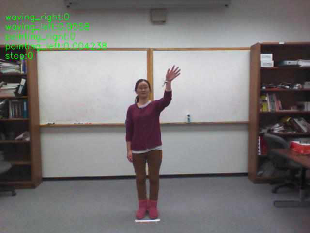

# Gesture recognition on human pose features of single images
homer_gestrec classifies five basic gesture types using [OpenPose](https://github.com/CMU-Perceptual-Computing-Lab/openpose). 

|  Gesture Id         |  Gesture class   | Description
|--|------------------|----------------------------
|1 | waving_right     |  Waving with right hand
|2 | waving_left      |  Waving with left hand 
|3 | pointing_right   |  Pointing with right hand
|4 | pointing_left    |  Pointing with left hand
|5 | stop             |  Prohibition sign




## Requirements

* `pip install scikit-learn==0.20.0`
* `pip install imblearn`

## Usage

### Load pre-trained models
Run the script for loading the  pre-trained models: 

`sh load_models.sh`


### Predict gesture using trained-models

* Note the sample_features.npz must containt the extracted pose features as of now

`python gesture_classification.py --pred=true --pretrained=true --model=random_forest.pkl`


### Train your own models
For training your own model, run 

`python gesture_classification.py --train=true`
You can change path to training data in ./config/training_data_description.yaml by modifying `path_to_trainig_data` paramter. Note, we expect numerical labels for classes in training dataset.  

## Cite

If you use this work please cite us as follows:

```
TODO: insert bibtex once published
```
